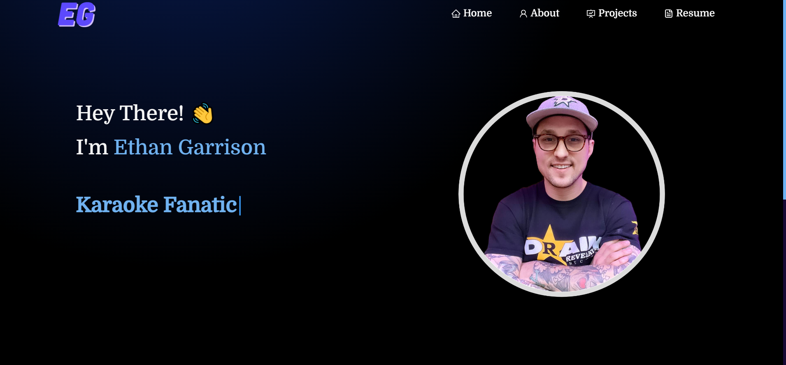
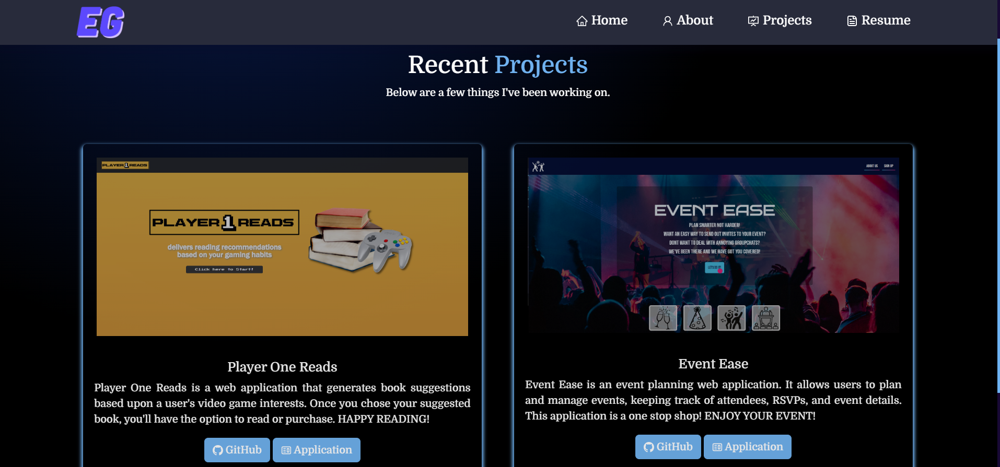
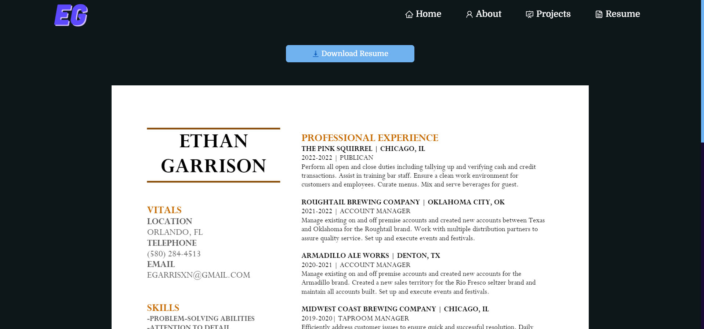
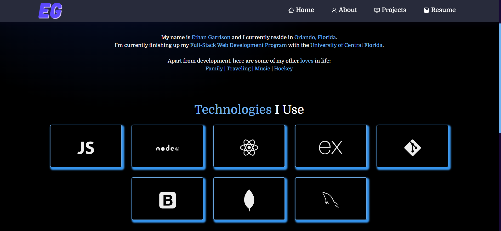

# Portfolio-Redux

Click here for the [Application](https://egarrisxn.github.io/Portfolio-Redux/)!

## Table of Contents

[Description](#description)

[Screenshots](#screenshots)

[Technologies-Used](#technologies-used)

[Credits](#credits)

[License](#license)

[Questions](#questions)

## Description

My React portfolio showcases my skills and projects in an engaging and interactive manner. With a sleek and modern design, it offers a seamless user experience while highlighting my expertise in web development. Explore my portfolio to see my latest work and get in touch to discuss potential collaborations.
 
 
Feel free to customize and modify it according to your specific portfolio and preferences.

## Screenshots

## Technologies Used

1. Node
2. React
3. Bootstrap
4. Axios

## Credits

I worked with my classmates to execute this project.
 
I also had a little help from ChatGPT.

## License

MIT

## Questions

[Link to Github](https://github.com/egarrisxn)

<a href="mailto:egarrisxn@gmail.com">egarrisxn@gmail.com</a>
